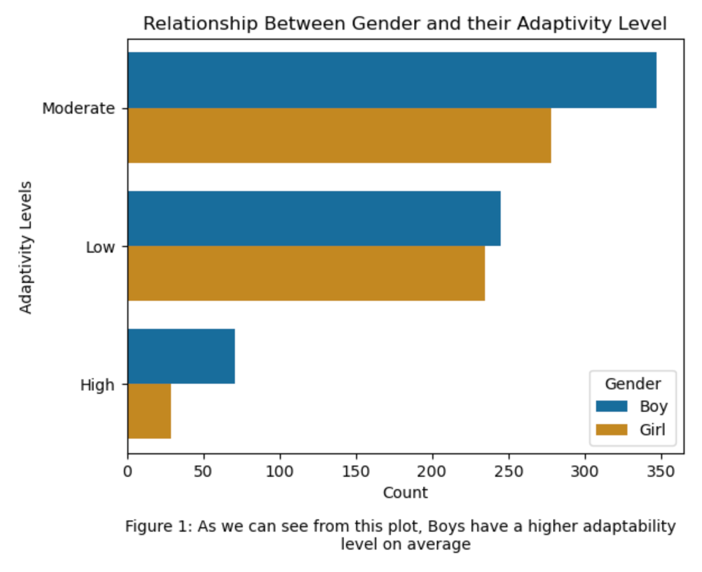
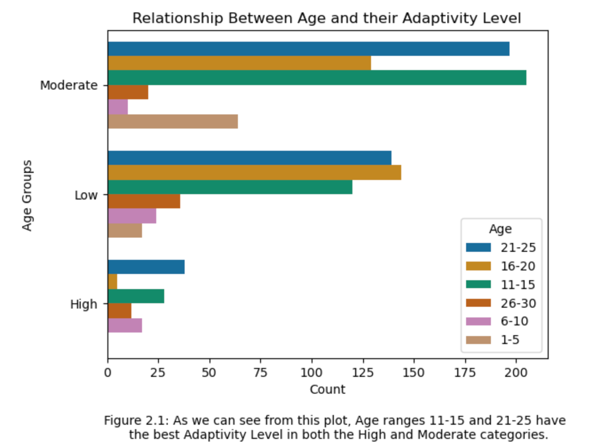
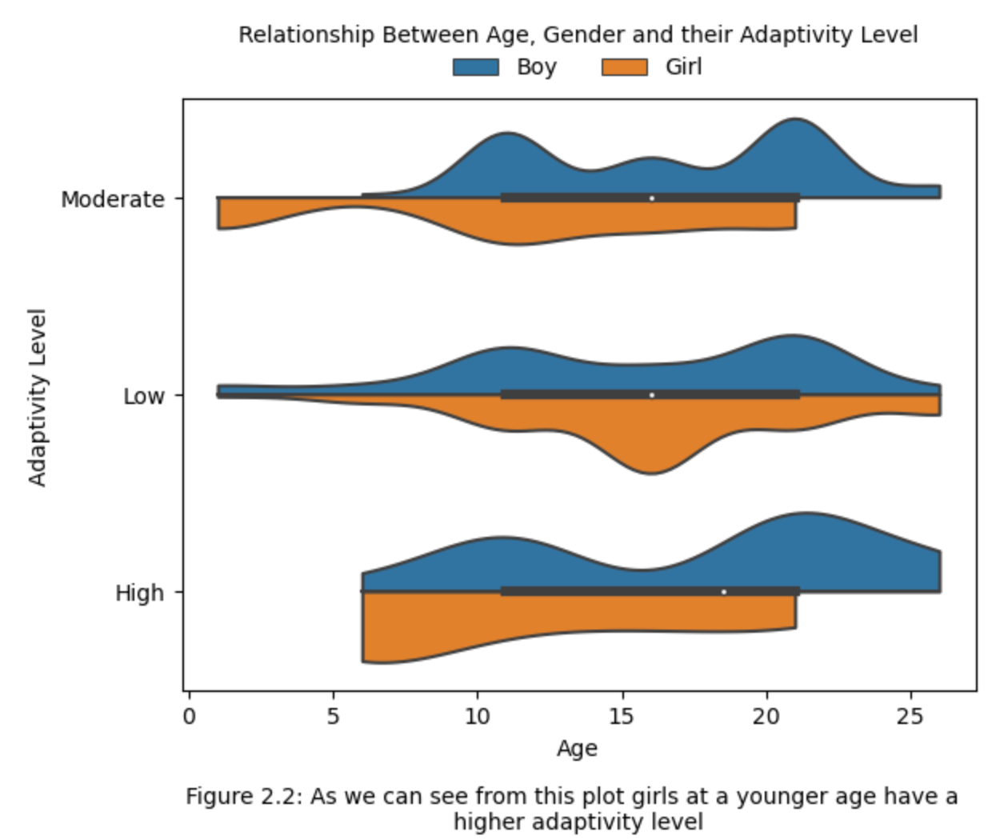
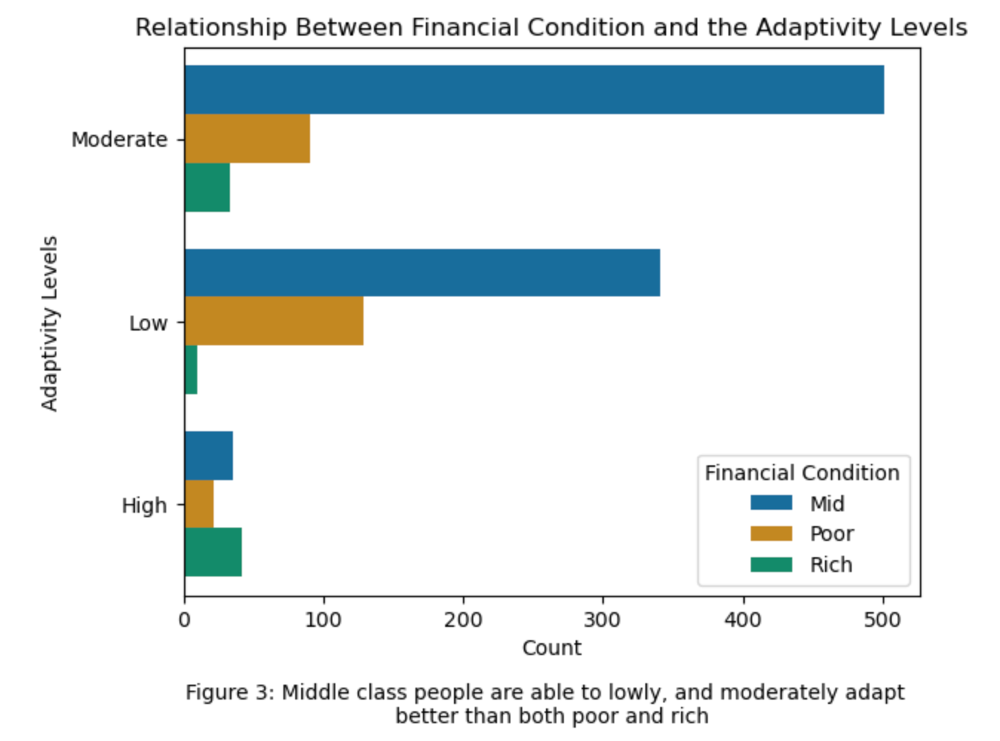
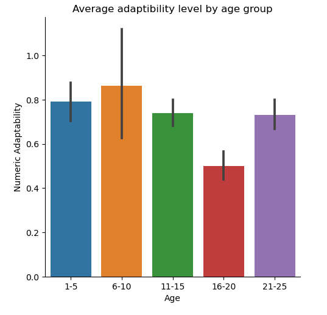
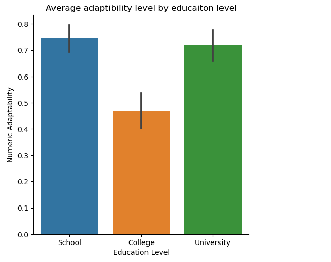
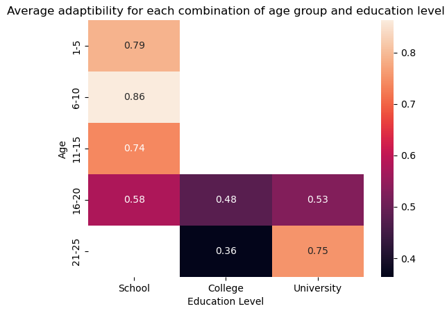
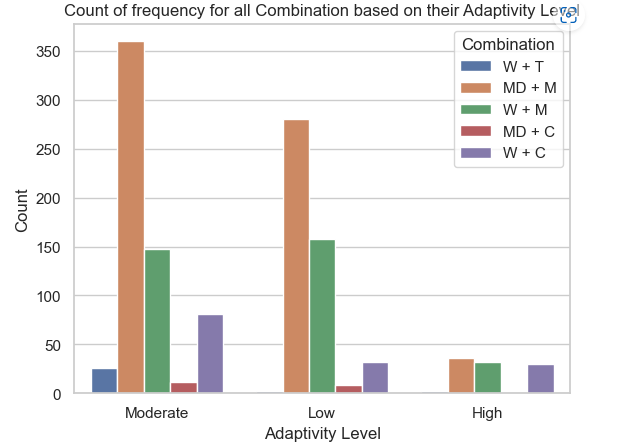
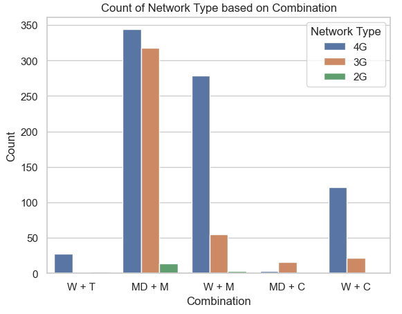

# Group 37: Students Adaptability Level in Online Education

## Introduction

This project is investigating multiple categorical variables that influence students from different backgrounds regarding their adaptivity level to online classes. As students ourselves, this issue is highly relatable as all three of us have been in that situation for almost 3 years due to the Covid-19 pandemic. Thus, it is important for us to see how different variables such as socio-economic status, device ownership, and maturity levels affect one’s adaptivity level to the online environment.

## Exploratory Data Analysis

This process might be tiring but it was worth the time because it allows us to discover which visualization answers the question the fastest and which one requires more work only to do the same task. Besides, it also happens that some of the visualizations are easier to get the punchline compared to the rest. For instance,...

## Question 1: How does someone's Socio-Economic Condition affect their Educational Adaptability? In particular, their `Gender`, `Age`, and `Financial Condition`

 
 

Click [here](analysis/analysis1.ipynb) to see detailed works for this question.

## Question 2: How does the maturity level of students affect their adaptability to online learning?

Firstly, in this data set there are two columns that pertain to a person's maturity level, `Age` and `Education Level`, and it is assumed that as a person progresses in life, be it in terms of their age or education level, they can also be considered more mature.

 

From these two graphs we can see that there is a dip in `Adaptability Levels` of students who are within the 16-20 age groups and students in college.

  

From this heatmap of average adaptability levels for students dipping in the same areas shown previously in the two barplots. We can also see that students within the 16-20 age group are people in all 3 education levels and all have approximately the same amount of difficulty regardless of which education level they are at, and college students between the age of 21-25 seem to struggle the most.

From these graphs it appears that there is no direct correlation between students becoming more adaptable as they mature. However, when put into more context, the results would make more sense. Children under 16 usually have more guidance from their parents or guardians, which could make adapting easier, while people in the age group of 16-20 are usually being left to work independently for the first time, which could be a large hurdle to overcome, making adapting to the new environment more difficult. 

Click [here](analysis/analysis2.ipynb) to see detailed works for this question.

## Q3: What combination of Device and Internet Type produces the best adaptivity level of students to online classes? What is the worst?

- Best combination: Combination with the most count for **high** `Adaptivity Levels`
- Worst combination: Combination with most count for **low** `Adaptivity Levels`

**Acronyms:**
- W + C	: WiFi & Computer
- W + T	: WiFi & Tab
- W + M	: WiFi & Mobile phone
- MD + C: Mobile data & Computer
- MD + M: Mobile data & Mobile phone

  

**Observation:** Combination of MD + M has the most count for both high & low adaptivity levels.

Hence, it can be claimed that **this combination is the best and also the worst** combination for students to adapt to online classes.

However, in the context of online education, it is understandable why this combination is the worst considering mobile phones' small screens and the limited data provided by mobile data. Students with this combination found it to be so uncomfortable to join their classes which eventually leads to low adaptivity levels. 

But how does the same combination become the best at the same time? This question brings us to a sub-question: 

**Does the combination of mobile data and mobile phone have the most count for 4G network?**

`Network Type` becomes the additional manipulated variable because it is possible for students with this combination to be the same people who get access to 4G (fastest network type in this dataset) the most. Thus, this might be able to make up for the uncomfortableness and improve their adaptivity level to high. 

  

**Observation:** Combination of MD + M has the most count for 4G and 2G networks. 

This result answers our curiosity about how the same combination can be the best combination as well. In other words, our previous assumption, 

> it is possible for students with this combination to be the same people who get access to 4G the most

Is justified. 

Moreover, this combination also happens to have the highest count for 2G network which is the slowest network in the dataset. So, this particular observation also supports the previously stated fact that it is the worst combination.

Click [here](analysis/analysis3.ipynb) to see detailed works for this question.

## Conclusion
